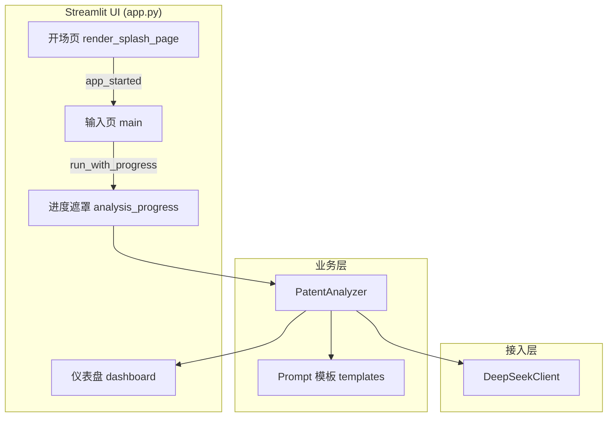

# PatentPilot

**AI 创新成果专利导航系统** — 面向创新者与科研人员的 Agent Demo，帮助在申请专利前快速理解技术方向、创新拥挤度、风险与可行动建议。

---

## 项目目标

PatentPilot 旨在用可解释的 AI 分析，降低「是否值得做专利布局」的判断成本：

| 受众 | 场景 | 价值 |
|------|------|------|
| 创新者 / 创业者 | 有一个新 idea，尚未形成完整技术方案 | 评估技术领域、创新拥挤度、潜在风险与突破方向 |
| 高校科研人员 | 已有论文摘要、项目描述或阶段性成果 | 判断科研成果的专利化潜力与改进建议 |

**定位说明**：本 Demo 输出的是**解释型、可理解的分析结论**，用于导航与决策参考，**不构成法律级专利审查意见**。

---

## Agent Demo 功能

### 用户流程

```
开场页 → 输入页（Idea / Research）→ API 分析（进度遮罩）→ 结果仪表盘（Bento）
```

### 1. 开场页（Splash）

- 品牌标题 **PatentPilot**、Slogan、**Get Started** 按钮、底部产品说明
- 视觉对齐设计稿：浅灰背景、青色（Teal）强调色、装饰光斑动画
- 主内容区支持 `vh` 垂直定位；单屏展示、禁止滚动
- **一次点击** 进入主应用（无二次点击）
- 开场路径采用**延迟 import**，避免加载仪表盘 / NumPy 等重模块

### 2. 主应用 — 输入页

- **侧边栏**：品牌、新建分析、模式切换、历史记录（示例）、API Key 设置
- **💡 Idea Mode**：描述创新 idea
- **🔬 Research Mode**：粘贴论文摘要 / 项目描述
- 输入卡片、模式标签、发送分析按钮
- 三张**示例卡片**，一键填入示例文案

### 3. 分析过程

- 调用 **DeepSeek**（经 ModelArts MaaS 兼容接口）
- 全屏进度遮罩：分阶段文案 + 进度条（后台线程执行分析，前台动画不阻塞 `st.rerun` 轮询）
- 遮罩相对**整页视口**定位，避免仅主内容区出现灰黑阴影

### 4. 结果仪表盘（Dashboard v3）

Bento 布局，主要包括：

- **结论区**：专利潜力评分、状态标签、摘要、技术领域 / 潜力标签
- **图表区**：五维雷达图（创新性、技术成熟度、市场需求、竞争密度、法律风险）、主要申请人专利热力图（示意数据）
- **行动建议**：机会、风险、下一步建议分类展示

支持 Idea / Research 两种模式下的字段映射与展示差异。

### 5. 备用运行方式

除 Streamlit 主应用外，仓库提供基于标准库的轻量 HTTP Demo（`run_server.py`，默认端口 `8502`），用于静态页 + `/api/analyze` 联调，**非主交互路径**。

---

## 系统设计

### 技术栈

| 层级 | 选型 |
|------|------|
| 前端 / Demo UI | [Streamlit](https://streamlit.io/) 1.32+ |
| 语言 | Python 3.10+ |
| LLM | DeepSeek（`DEEPSEEK_API_URL` / `DEEPSEEK_MODEL` 可配置） |
| 配置 | `python-dotenv` + `.env` |
| 数值 / 图表示意 | NumPy（仅结果页加载） |

### 架构概览



### 目录结构

```
PatentPilot/
├── app.py                      # Streamlit 主入口（路由、样式、页面编排）
├── run_server.py               # 可选：标准库 HTTP Demo
├── requirements.txt
├── .env.example
├── .streamlit/config.toml      # Streamlit 主题（Teal 主色）
├── web/
│   ├── patentpilot_splash.html # 开场品牌区 HTML（iframe 注入）
│   └── index.html              # HTTP Demo 静态页
├── src/
│   ├── config.py               # 环境变量
│   ├── api/client.py           # DeepSeek HTTP 客户端
│   ├── prompts/templates.py    # Idea / Research 提示词与 JSON 结构
│   ├── services/analyzer.py    # 分析编排与 JSON 解析
│   └── ui/
│       ├── analysis_progress.py  # 分析进度遮罩
│       └── dashboard.py          # 结果仪表盘 v3
└── preview/                    # HTML / 组件设计稿与本地预览脚本
```

### 关键设计决策

1. **开场与主应用分离**  
   `app_started` 为 `False` 时仅渲染 `render_splash_page()` 并 `st.stop()`，不执行 `inject_main_app_styles()` / `main()`。

2. **延迟 import**  
   `PatentAnalyzer`、`run_with_progress`、`render_analysis_dashboard` 仅在分析或展示结果时导入，缩短开场冷启动时间。

3. **开场 HTML 双轨**  
   品牌 + Slogan 在 `components.html` iframe 中渲染；按钮与页脚由 Streamlit 原生组件渲染，便于交互与样式统一。

4. **进度 UI**  
   `run_with_progress` 使用后台线程 + `st.empty()` 占位更新，单脚本运行内刷新进度 HTML，避免分析过程中频繁 `rerun`。

5. **Prompt 契约**  
   Idea / Research 模式使用不同 system prompt 与 JSON schema，由 `PatentAnalyzer._parse_json` 解析模型返回（支持 fenced JSON）。

---

## 当前进展

### 已完成

- [x] Streamlit 主流程：开场页 → 输入页 → 分析 → 仪表盘
- [x] Idea Mode / Research Mode 双模式与 DeepSeek 接入
- [x] Dashboard v3（Bento + 雷达图 + 热力图 + 结论面板）
- [x] 分析进度遮罩与分阶段文案
- [x] 开场页布局：居中、固定一屏、`vh` 定位、标题字号与按钮间距调优
- [x] Get Started **单击**进入（移除依赖 iframe JS 的两步跳转）
- [x] 进度遮罩全视口定位与浅色蒙层（修复主内容区灰黑阴影问题）
- [x] 开场页**延迟 import** 优化加载
- [x] 设计稿与预览资源（`preview/`、`web/patentpilot_splash.html`）

### 已知限制

- 热力图、部分图表维度为 **Demo 示意数据**，非真实专利库检索结果
- 开场页仍加载完整 `patentpilot_splash.html` 再在 iframe 内隐藏多余节点，有进一步优化空间
- 历史记录为会话内示例列表，未持久化到数据库
- 需自行配置有效的 `DEEPSEEK_API_KEY` 方可完成真实分析

---

## 后续计划

### 性能与体验

- [ ] 精简开场 iframe 载荷（仅保留品牌 + Slogan 的轻量 HTML）
- [ ] 缓存 `_load_splash_html_for_streamlit()`，减少重复磁盘读取
- [ ] 评估用 `st.markdown` 替代 iframe 渲染标题区（需像素级对齐验证）
- [ ] 可选：开场页 `initial_sidebar_state="collapsed"`，减少 Streamlit 侧边栏初始化开销

### 功能

- [ ] 历史记录持久化（本地 SQLite 或文件）
- [ ] 分析结果导出（PDF / Markdown）
- [ ] 接入真实专利检索 API（替换示意热力图与竞争数据）
- [ ] 多轮对话式澄清（Agent 追问技术细节后再出报告）

### 工程化

- [ ] 单元测试：`PatentAnalyzer._parse_json`、Prompt 构建
- [ ] CI：lint +  smoke test（mock LLM）
- [ ] Docker / 一键部署说明
- [ ] 完善 `README` 英文版与截图/GIF

---

## 快速开始

### 环境要求

- Python 3.10+
- 可访问 DeepSeek（或所配置的 MaaS 端点）的网络环境

### 安装

```bash
git clone <your-repo-url>
cd PatentPilot
python -m venv .venv
# Windows
.venv\Scripts\activate
# macOS / Linux
# source .venv/bin/activate

pip install -r requirements.txt
cp .env.example .env
# 编辑 .env，填入 DEEPSEEK_API_KEY
```

### 启动 Streamlit（推荐）

```bash
streamlit run app.py
```

浏览器打开终端输出的地址，默认为 **http://localhost:8501**。

若出现 `ERR_CONNECTION_REFUSED`，说明进程未启动或端口不一致，请确认终端中 `streamlit run` 仍在运行，并核对打印的 Local URL。

指定端口示例：

```bash
streamlit run app.py --server.port 8515
```

### 环境变量

| 变量 | 说明 | 默认值 |
|------|------|--------|
| `DEEPSEEK_API_KEY` | API 密钥（必填，也可在侧边栏临时输入） | — |
| `DEEPSEEK_API_URL` | Chat Completions 端点 | ModelArts MaaS v2 |
| `DEEPSEEK_MODEL` | 模型名称 | `deepseek-v4-pro` |

### 可选：HTTP Demo

```bash
python run_server.py
# 访问 http://127.0.0.1:8502
```

---

## 配置说明

Streamlit 主题见 `.streamlit/config.toml`（主色 `#14b8a6`）。开场垂直偏移可在 `app.py` 中调整常量 `SPLASH_TOP_OFFSET_VH`。

---

## 免责声明

PatentPilot Demo 仅供产品演示与技术验证。分析结果基于大模型通用知识生成，**不能替代专利律师或官方检索系统的专业意见**。正式申请专利前，请咨询具备资质的专业机构并完成官方检索。

---

## License

如需开源发布，请在本仓库补充所选许可证（如 MIT）。当前仓库以 Demo 为主，使用前请确认 API 服务条款与数据合规要求。
