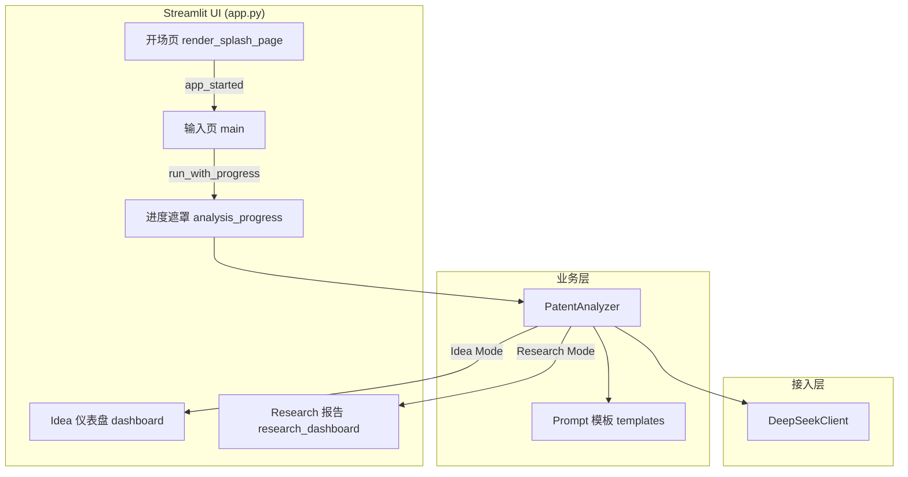

# PatentPilot

**专利潜力初筛与导航工具** — 在正式申请专利之前，用自然语言快速验证想法可行性、识别改进方向，帮助两类用户做出更 informed 的决策。

> **Slogan**：检验你的想法是不是一个申请专利的金点子！  
> **说明**：面向小白创新者与专业科研人员的专利潜力初筛工具 · 非正式法律意见

---

## 产品定位

PatentPilot 聚焦**专利申请的前置阶段**：在用户尚未投入大量检索成本、尚未形成完整技术方案时，提供可理解的 AI 分析结论，回答「这个想法值不值得继续往专利方向推进」以及「下一步该怎么改」。

| 用户群体 | 典型场景 | PatentPilot 价值 |
|----------|----------|------------------|
| **创新小白 / 创业者** | 有一个模糊 idea，缺乏专利规划经验 | 快速了解技术领域、创新拥挤度、主要风险与可突破方向 |
| **科研工作者 / 高校团队** | 已有论文摘要、项目描述或阶段性成果 | 评估科研成果的专利化潜力，获得结构化改进建议与策略参考 |

**重要声明**：本工具输出的是**解释型、可理解的分析结论**，用于导航与决策参考，**不构成法律级专利审查意见或 FTO（自由实施）结论**。正式申请前请咨询具备资质的专业机构并完成官方检索。

---

## 产品创新与差异点

### 与智慧芽等检索平台的定位差异

| 维度 | 智慧芽等专利检索平台 | PatentPilot |
|------|----------------------|-------------|
| **使用阶段** | 已有较成熟技术方案，投入资源做**重复性检索** | 申请专利**之前**，做想法/成果的**可行性初筛** |
| **核心问题** | 该领域是否已有相同或近似专利？ | 这个想法/成果是否值得专利化？风险在哪？如何改进？ |
| **用户门槛** | 面向专业人士，检索式、分类号、法律状态等认知成本较高 | **自然语言交互**，描述 idea 或粘贴摘要即可 |
| **商业模式倾向** | 以 **2B** 企业、律所、研发机构为主 | 更面向**个人创新者与小团队**的轻量验证 |
| **输出形态** | 专利列表、法律状态、引证关系等检索结果 | 结构化报告：评分、多维评估、风险说明、行动建议 |

**一句话概括**：智慧芽解决的是「有没有撞车」；PatentPilot 解决的是「值不值得做、怎么做更好」——两者互补，而非替代关系。

### 双模式设计

```
                    ┌─────────────────────────────────┐
                    │         PatentPilot             │
                    └─────────────────────────────────┘
                                      │
              ┌───────────────────────┴───────────────────────┐
              ▼                                               ▼
     💡 Idea Mode（非专业）                          🔬 Research Mode（专业）
     自然语言描述创新想法                            粘贴论文摘要 / 项目描述
     Bento 仪表盘 + 五维雷达                         科研风报告 § I–V + PPI 指数
     面向「尚无成熟方案」的小白                        面向「已有成果待转化」的科研团队
```

---

## 项目内容

### 用户流程

```
开场页 → 输入页（Idea / Research）→ AI 分析（进度遮罩）→ 结果报告
```

### 1. 开场页（Splash）

- 品牌 **PatentPilot**、中文 Slogan、**Get Started** 按钮、底部产品说明
- 视觉：浅灰背景、Teal 强调色、装饰光斑动画；主内容区 `vh` 垂直定位，单屏无滚动
- **一次点击**进入主应用；开场路径**延迟 import** 重模块，缩短冷启动

### 2. 主应用 — 输入页

- **侧边栏**：品牌、新建分析、模式切换、会话内历史示例
- **💡 Idea Mode**：用自然语言描述创新 idea
- **🔬 Research Mode**：粘贴论文摘要、项目描述或阶段性成果
- 三张**示例卡片**，一键填入示例文案

### 3. 分析过程

- 调用 **DeepSeek**（经 ModelArts MaaS 兼容接口，可配置）
- 全屏进度遮罩：分阶段文案 + 进度条（后台线程执行，前台动画不阻塞）
- API Key 从 **Streamlit Secrets / 环境变量** 读取，不在 UI 暴露

### 4. 结果报告

#### Idea Mode — Bento 仪表盘（`dashboard.py`）

- **结论区**：专利潜力评分、状态标签、摘要、技术领域标签
- **图表区**：五维雷达图（创新性、技术成熟度、市场需求、竞争密度、法律风险）
- **行动建议**：机会、风险、下一步建议分类展示
- 主要申请人专利热力图为 **Demo 示意数据**

#### Research Mode — 科研风报告（`research_dashboard.py`）

- **顶栏 KPI**：专利化潜力指数（PPI）、潜力等级、申请策略建议
- **§ I** 综合结论 · **§ II** 创新性分析 · **§ III** 风险与不足
- **§ IV** 专利性多维评估（新颖性、创造性、实用性、现有技术关联度、权利要求可撰写性）
- **§ V** 策略建议（可执行条目列表）
- 左侧信息栏固定、右侧正文滚动；顶栏 `sticky` 吸顶

### 5. 备用运行方式

仓库提供基于标准库的轻量 HTTP Demo（`run_server.py`，默认端口 `8502`），用于静态页 + `/api/analyze` 联调，**非主交互路径**。

---

## 系统设计

### 技术栈

| 层级 | 选型 |
|------|------|
| 前端 / Demo UI | [Streamlit](https://streamlit.io/) 1.32+ |
| 语言 | Python 3.10+ |
| LLM | DeepSeek（`DEEPSEEK_API_URL` / `DEEPSEEK_MODEL` 可配置） |
| 配置 | `python-dotenv` + `.env`；云端 `st.secrets` |
| 数值 / 图表示意 | NumPy（仅 Idea 结果页加载） |

### 架构概览



### 目录结构

```
PatentPilot/
├── app.py                          # Streamlit 主入口（路由、样式、页面编排）
├── run_server.py                   # 可选：标准库 HTTP Demo
├── requirements.txt
├── .env.example
├── .streamlit/config.toml          # Streamlit 主题（Teal 主色）
├── docs/
│   └── PatentPilot项目说明.docx    # 项目说明文档（Word）
├── web/
│   ├── patentpilot_splash.html     # 开场品牌区 HTML（iframe 注入）
│   └── index.html                  # HTTP Demo 静态页
├── src/
│   ├── config.py                   # Secrets / 环境变量
│   ├── api/client.py               # DeepSeek HTTP 客户端
│   ├── prompts/templates.py        # Idea / Research 提示词与 JSON 契约
│   ├── services/analyzer.py        # 分析编排与 JSON 解析
│   └── ui/
│       ├── analysis_progress.py    # 分析进度遮罩
│       ├── dashboard.py            # Idea Mode 结果仪表盘 v3
│       └── research_dashboard.py   # Research Mode 科研风报告
└── preview/                        # HTML 设计稿与本地预览脚本
```

### 关键设计决策

1. **开场与主应用分离** — `app_started` 为 `False` 时仅渲染开场页并 `st.stop()`，不加载主应用样式与分析模块。
2. **延迟 import** — `PatentAnalyzer`、仪表盘、NumPy 等仅在分析或展示结果时导入，缩短开场冷启动。
3. **双 Prompt 契约** — Idea / Research 使用不同 system prompt 与 JSON schema；Research 额外输出 `dimension_scores` 供多维评估表渲染。
4. **双仪表盘** — Idea 侧重直观 Bento + 雷达图；Research 侧重结构化学术报告，匹配两类用户认知习惯。
5. **进度 UI** — 后台线程 + `st.empty()` 占位更新，避免分析过程中频繁 `st.rerun`。
6. **安全配置** — API Key 仅通过 Secrets / `.env` 注入，侧边栏不再提供 Key 输入框。

---

## 当前完成情况

### 已完成

- [x] Streamlit 主流程：开场页 → 输入页 → 分析 → 双模式结果报告
- [x] **Idea Mode** / **Research Mode** 双模式与 DeepSeek 接入
- [x] Idea 仪表盘 v3（Bento + 雷达图 + 热力图 + 结论面板）
- [x] Research 科研风报告（§ I–V、PPI、多维矩阵、策略建议、sticky 顶栏）
- [x] 分析进度遮罩与分阶段文案；全视口浅色蒙层
- [x] 开场页布局调优（`vh` 定位、单击进入、延迟 import）
- [x] API Key 改为 Secrets / 环境变量；支持 Streamlit Community Cloud 部署
- [x] 设计稿与预览资源（`preview/`、`web/patentpilot_splash.html`）

### 已知限制

- 热力图、部分竞争维度为 **Demo 示意数据**，非真实专利库检索
- 历史记录为会话内示例，**未持久化**
- 分析基于大模型通用知识，**不能替代**官方专利检索与法律意见

---

## 运行效果

本地或云端部署后，典型体验如下：

1. **开场页**：品牌 + Slogan 居中展示，单击 **Get Started** 进入主应用。
2. **输入页**：切换 Idea / Research 模式，输入自然语言或粘贴摘要，点击分析。
3. **分析中**：全屏进度遮罩展示分阶段文案与进度条。
4. **Idea 结果**：Bento 布局仪表盘，潜力评分、雷达图、机会/风险/建议分区展示。
5. **Research 结果**：科研风长报告，含 PPI、五维评估表与分节策略建议。

> 详细截图与产品说明见 `docs/PatentPilot项目说明.docx`。

---

## 后续计划

### 体验与性能

- [ ] 精简开场 iframe 载荷，进一步缩短冷启动
- [ ] 缓存开场 HTML 读取；评估用 `st.markdown` 替代 iframe 标题区

### 功能

- [ ] 历史记录持久化（SQLite 或本地文件）
- [ ] 分析结果导出（PDF / Markdown / Word）
- [ ] 接入真实专利检索 API，替换示意热力图与 prior art 数据
- [ ] 多轮对话式澄清（Agent 追问技术细节后再出报告）

### 工程化

- [ ] 单元测试：`PatentAnalyzer._parse_json`、Prompt 构建
- [ ] CI：lint + smoke test（mock LLM）
- [ ] Docker / 一键部署说明
- [ ] README 英文版与演示 GIF

---

## 快速开始

### 环境要求

- Python 3.10+
- 可访问 DeepSeek（或所配置 MaaS 端点）的网络环境
- 有效的 `DEEPSEEK_API_KEY`

### 安装

```bash
git clone <your-repo-url>
cd PatentPilot
python -m venv .venv

# Windows
.venv\Scripts\activate
# macOS / Linux
# source .venv/bin/activate

pip install -r requirements.txt
cp .env.example .env
# 编辑 .env，填入 DEEPSEEK_API_KEY
```

### 启动 Streamlit（推荐）

```bash
streamlit run app.py
```

浏览器打开终端输出的地址，默认为 **http://localhost:8501**。

指定端口：

```bash
streamlit run app.py --server.port 8515
```

Research 报告预览（勿占用 8501）：

```bash
streamlit run preview/research_dashboard_demo.py --server.port 8502
```

### 环境变量

| 变量 | 说明 | 默认值 |
|------|------|--------|
| `DEEPSEEK_API_KEY` | API 密钥（必填） | — |
| `DEEPSEEK_API_URL` | Chat Completions 端点 | ModelArts MaaS v2 |
| `DEEPSEEK_MODEL` | 模型名称 | `deepseek-v4-pro` |

**Streamlit Cloud**：在 App Settings → Secrets 中配置同名键值，例如：

```toml
DEEPSEEK_API_KEY = "sk-..."
```

### 可选：HTTP Demo

```bash
python run_server.py
# 访问 http://127.0.0.1:8502
```

---

## 配置说明

- Streamlit 主题：`.streamlit/config.toml`（主色 `#14b8a6`）
- 开场垂直偏移：`app.py` 中常量 `SPLASH_TOP_OFFSET_VH`（当前 `29`）

---

## 免责声明

PatentPilot 仅供产品演示、教学与技术验证。分析结果基于大模型通用知识生成，**不能替代专利律师或官方检索系统的专业意见**。正式申请专利前，请咨询具备资质的专业机构并完成官方检索。

---

## License

如需开源发布，请在本仓库补充所选许可证（如 MIT）。使用前请确认 API 服务条款与数据合规要求。
